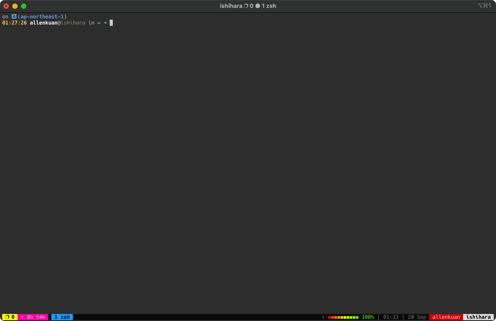
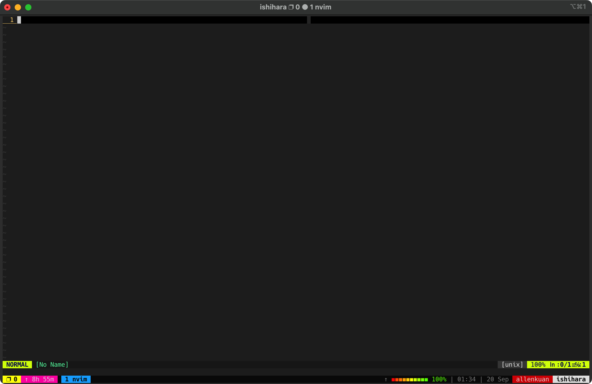

dot_files
=========

我的 zsh + vim + tmux 等等等的環境設定

包含：

* oh-my-zsh
* starship
* vim plugins
* tmux config
* zsh theme

### 螢幕截圖

#### vim

### 安裝
#### Prerequirement
* vim (with Python support)
* zsh
* sudo、python-pip、git

#### 流程
1. 把repository clone回去

   	git clone git@github.com:fykuan/dot_files.git

2. 執行install.sh，會把該拉回來的都拉回來
